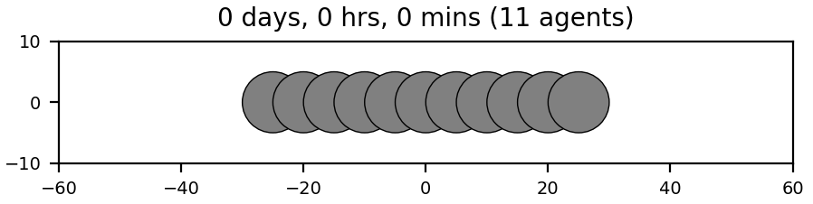
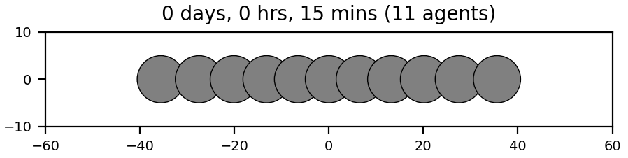
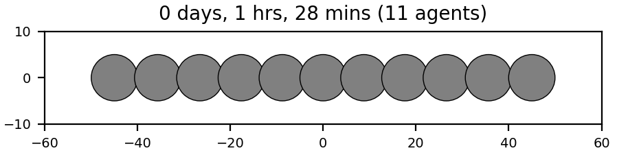
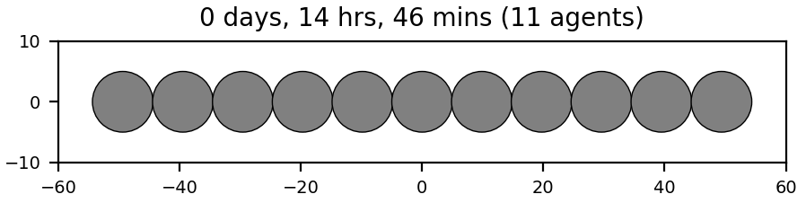
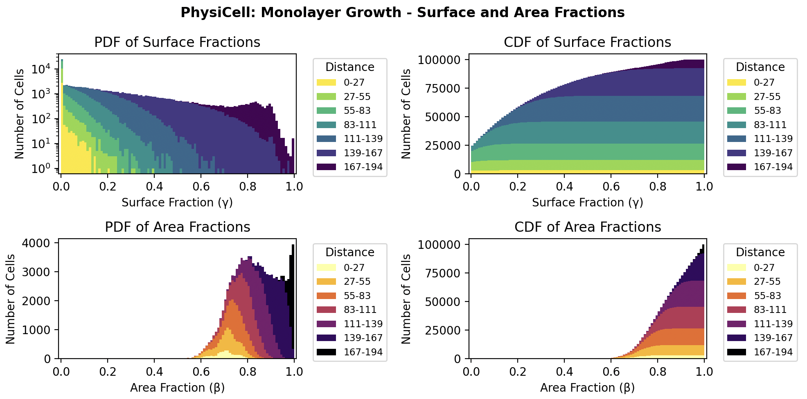
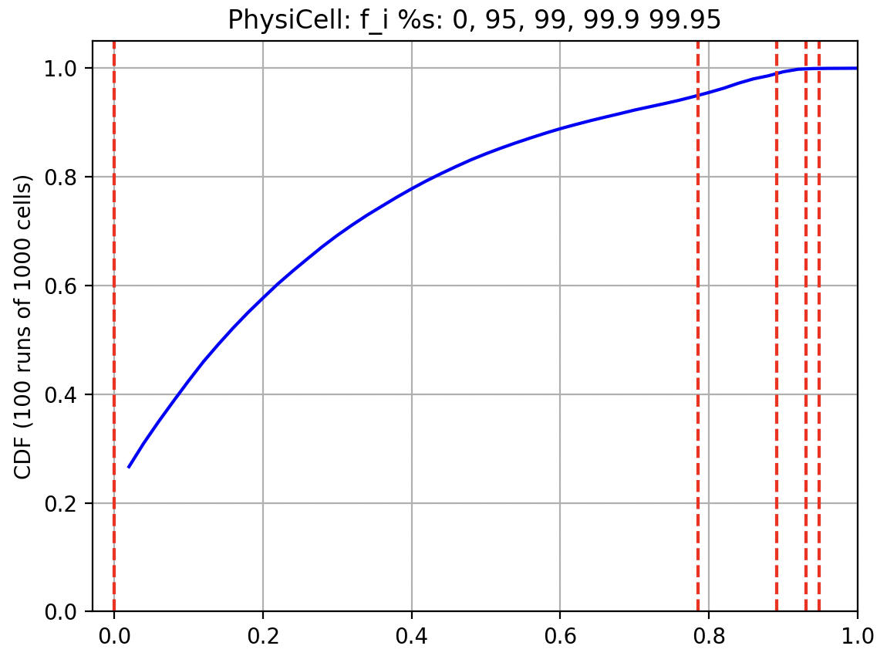
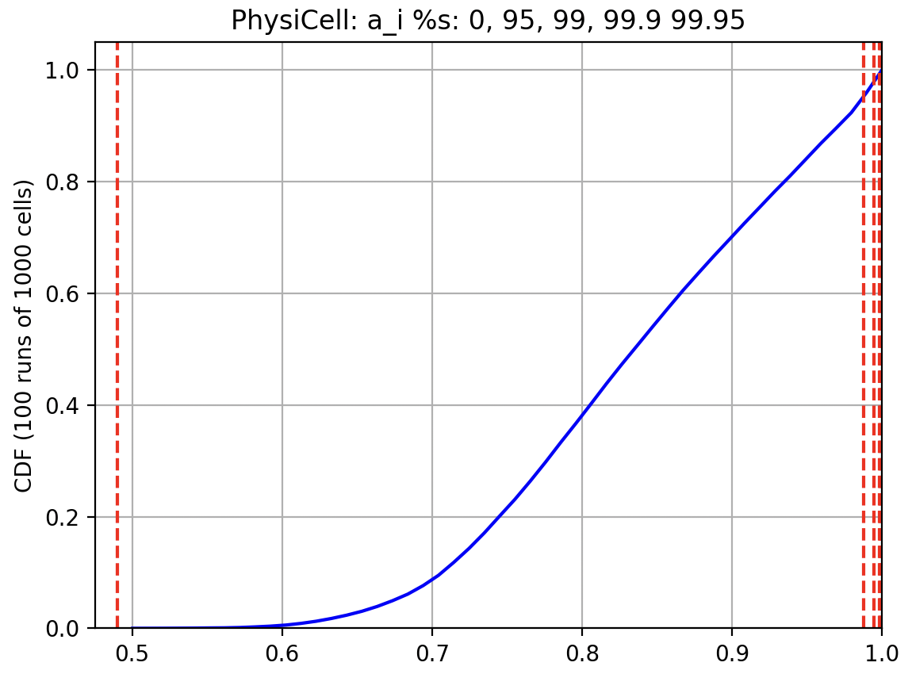

# PhysiCell: an Open Source Physics-Based Cell Simulator for 3-D Multicellular Systems

This repository provides a PhysiCell model and simulation results for a growing (2D) monolayer. This is one "reference model" in the [OpenVT] (https://www.openvt.org/) project. This project has distinct, but related, sub-projects:
<ul>
  <li>11 cells, simple relaxation</li>
  <li>21 cells: 11+10 simple relaxation</li>
  <li>1000 cell monolayer, no contact inhibition</li>
  <li>10000 cell monolayer, 5x5 phase diagram of gamma, beta thresholds for contact inhibition</li>
</ul>

## 11 cells, simple relaxation

In this model, we have 11 cells along the x-axis. Each cell overlaps its neighbor by a radius length (R=5) at t=0 and then the model undergoes its normal relaxation (repulsion only, there's no cell-cell adhesion).

To build this model:
```
make load PROJ=quadratic_force_11cells
make
./project   # or project.exe on Windows
# optionally, use PhysiCell Studio to run and visualize results (shown below)

# To see the time (mins) that it takes for the cells width to reach 90% of their totally relaxed state:
more output_11cells/time_90pct.txt
88.66
```
This time to reach 90% relaxed width will represent a cell cycle duration (when cell division would occur). However, based on early results, we eventually chose to use 5x this duration time.


At t=0


At t~=88, we reach 90% width (leftmost cell has x=-45; rightmost x=45)


<hr>

## 1000 cells, no contact inhibition

Terminology:
* gamma - fraction of a cell's surface that is free (not in contact with neighbor cells)
* beta - fraction of a cell's area that is free (not overlapping with neighbor cells)

For this part of the project, we ran 100 replicates of a growing monolayer, with no contact inhibition, up to 1000 cells. We then generate a probability density function and cumulative density function for both gamma and beta.



(Thanks to Dr. Domenic Germano (@DGermano8) for the nice plotting scripts!)


## 5x5 phase diagram for f_i, a_i values

Once we have the CDF for both gamma and beta, we choose fixed percentiles to map back to actual values that will be used as thresholds in the 10K cell monolayer simulations.

  


## PhysiCell release

This version came from the "mech_grid_xml" branch of PhysiCell 1.14.2, so we could easily modify and experiment with PhysiCell's mechanics voxel size. As it turned out, we did not end up needing this feature, so the 1.14.2 release should suffice for this project.

## Funding

NSF #2303695, “Pathways to Enable Open-Source Ecosystems (POSE): PHASE II: Open VT - A Standardized Ecosystem for Virtual Tissue Simulation.”
